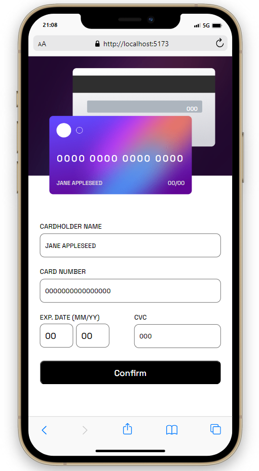

# Frontend Mentor - Interactive card details form solution

This is a solution to the [Interactive card details form challenge on Frontend Mentor](https://www.frontendmentor.io/challenges/interactive-card-details-form-XpS8cKZDWw). Frontend Mentor challenges help you improve your coding skills by building realistic projects. 

## Table of contents

- [Overview](#overview)
  - [The challenge](#the-challenge)
  - [Screenshot](#screenshot)
  - [Links](#links)
- [My process](#my-process)
  - [Built with](#built-with)
  - [What I learned](#what-i-learned)
- [Author](#author)

## Overview

### The challenge

Users should be able to:

- Fill in the form and see the card details update in real-time
- Receive error messages when the form is submitted if:
  - Any input field is empty
  - The card number, expiry date, or CVC fields are in the wrong format
- View the optimal layout depending on their device's screen size
- See hover, active, and focus states for interactive elements on the page

### Screenshot

### Links

- Solution URL: [Github repo](https://github.com/diegopaff/Frontend_Mentor_ch03)
- Live Site URL: [Live site preview](https://frontendcha03.netlify.app/)

## My process

### Built with

- Javascript
- CSS
- Mobile-first workflow
- [React](https://reactjs.org/) - JS library
- [React Hook Form](https://react-hook-form.com/) - React hook to handle and validate form data

### What I learned

- I learn how to mask text data to show only what you need. For example in the credit card number the space every four numbers its only visual.
- I learn to validate inputs and render error messages to wrong format inputs using react hook form.
- It was painfull to get back with only css to style this project, i started naming all the clases without BEM rules and very quickly turn into a lot of classes that makes the responsive part more dificult, this was a very good learning of what no do ever again. Next project i will use SASS for the styling.

## Author

- Website - [Diego Curutchet](https://diegocurutchetdev.netlify.app/)
- Frontend Mentor - [@diegopaff](https://www.frontendmentor.io/profile/diegopaff)

